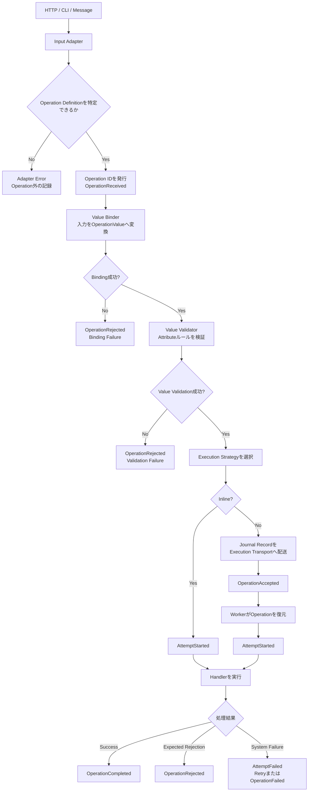

# D005: OperationValueとバリデーション

Status: Decided

## Context

D004の回答により、Operationの業務入力を別のOperationValueクラスとして定義し、Value側でバリデーションルールを管理する案が提示された。

この変更は、D001で仮定した「Operationオブジェクトが業務入力を直接保持する」という構造を更新する可能性がある。この設計対話では、Operation定義、OperationValue、Handler、入力バリデーションの関係を決める。

## Question 1: OperationとOperationValueの構造

OperationとOperationValueをどのように分離するか。

### Options

- A: Operationクラスは処理の定義とAttributeだけを持ち、OperationValueはEnvelope内で別に保持する
- B: Operationインスタンスが、一つのOperationValueをコンストラクタで保持する
- C: OperationValue自体をOperationとして扱い、別のOperationクラスを作らない

### Recommendation

Aを推奨する。

```php
#[OperationType('order.create')]
#[Accepts(CreateOrderValue::class)]
#[Route('POST', '/orders')]
final class CreateOrder implements Operation
{
}

final readonly class CreateOrderValue implements OperationValue
{
    public function __construct(
        public CustomerId $customerId,
        public array $items,
    ) {
    }
}
```

Operationクラスは、ルーティング、型ID、Strategy、対応Valueなどを宣言するOperation Definitionになる。論理的なOperationの実体は、Operation Definition、Value、ID、Contextなどを持つEnvelopeとして表現する。

[ANSWER]

A

[/ANSWER]

## Question 2: OperationとValueの関連付け

Operationが受け取るValue型をどのように宣言するか。

### Options

- A: `#[Accepts(CreateOrderValue::class)]` Attributeで宣言する
- B: OperationインターフェースのPHPDoc Genericで宣言する
- C: OperationクラスのメソッドがValueのクラス名を返す

### Recommendation

Aを推奨する。

Operationに関する宣言をAttributeへ統一しやすく、ReflectionでRegistryを構築できる。PHPStan拡張を提供する場合は、AttributeとHandlerの型が一致することも検査できる。

[ANSWER]

A

[/ANSWER]

## Question 3: バリデーションルール

OperationValueのバリデーションをどのように定義するか。

### Options

- A: プロパティのPHP Attributeで宣言する
- B: OperationValueが `validate()` メソッドを実装する
- C: Value外部のValidatorクラスへ定義する
- D: Attributeを基本とし、複雑な業務ルールは外部Validatorで追加する

### Recommendation

Dを推奨する。

```php
final readonly class CreateOrderValue implements OperationValue
{
    public function __construct(
        #[NotBlank]
        public string $customerId,
        #[Count(min: 1)]
        public array $items,
    ) {
    }
}
```

単純な形式検証はValueの近くへ置き、DB参照が必要な検証や複数項目にまたがる業務ルールは外部ValidatorまたはHandlerへ分離する。

[ANSWER]

一旦Aでよい。外部Validatorがよくわかってない。

[/ANSWER]

## Question 4: バリデーションの段階

入力検証をどの段階へ分けるか。

### Options

- A: すべてOperationValue生成前に行い、失敗時はOperationを作らない
- B: 入力の型変換後、すべての検証を一度に行う
- C: Binding Validation、Value Validation、Business Validationの三段階へ分ける

### Recommendation

Cを推奨する。

| 段階 | 内容 | 担当 |
| --- | --- | --- |
| Binding | JSON形式、型変換、必須フィールド | Input Adapter / Value Binder |
| Value | 文字数、範囲、形式、項目間整合性 | OperationValue Validator |
| Business | 在庫、権限、重複など外部状態に依存 | Handler / Domain |

D002の決定に従い、対象Operationを特定できた後のValue ValidationとBusiness Validationの失敗は、Operation IDを持つ `OperationRejected` として記録する。

[ANSWER]

C、Businessはいらないかも。データを照合するものはユーザーが実装する方針

[/ANSWER]

## Question 5: Binding失敗時のJournal

型変換に失敗してOperationValueを生成できなかった場合、Journalへ何を記録するか。

### Options

- A: Operation IDと拒否理由だけを記録し、生の入力値はJournalへ含めない
- B: 再現可能性のため、生の入力値をすべてJournalへ含める
- C: セキュリティフィルタを通した入力Snapshotを任意で記録する

### Recommendation

Cを推奨する。

不正入力には攻撃文字列や機密値が含まれる可能性があるため、生データを無条件に記録しない。Operation ID、Type ID、拒否理由は必ず記録し、安全なSnapshotだけを任意で追加する。

[ANSWER]

C、バリデーション失敗したというジャーナルとして記録するべき

[/ANSWER]

## Question 6: Handlerのシグネチャ

Handlerは何を受け取るか。

### Options

- A: 対応するOperationValueだけを受け取る
- B: Operation Envelope全体を受け取る
- C: OperationValueとExecution Contextを別々に受け取る

### Recommendation

Cを推奨する。

```php
final class CreateOrderHandler
{
    public function handle(
        CreateOrderValue $value,
        ExecutionContext $context,
    ): CreateOrderOutcome {
    }
}
```

業務入力と実行Contextを分けたまま、Operation IDや認証主体など、Handlerが必要とするメタデータへ明示的にアクセスできる。

[ANSWER]

Handlerの発動するタイミングがわかってないのでmermaidで一連の流れを一旦整理してほしい。
ExecutionContextはどんなデータが入ってるものですか？

[/ANSWER]

## Follow-up 1: Handlerが発動するまでの流れ

Handlerは、入力をOperationValueへ変換し、FWが担当するValue Validationに成功した後で発動する。



FWが標準で検証するのは、次の二段階とする。

| 段階 | 内容 | 担当 |
| --- | --- | --- |
| Binding | 入力形式、型変換、必須フィールド | Input Adapter / Value Binder |
| Value Validation | 文字数、範囲、形式などのAttributeルール | OperationValue Validator |

在庫確認、DB上の重複確認、利用権限など、外部状態との照合はFWのValidator機構に含めない。ユーザーがHandlerまたはDomain層で実装し、予期された不成立はRejected Outcomeとして返す。

## Follow-up 2: ExecutionContext

ExecutionContextは、業務入力ではないがHandlerが処理中に参照する可能性のある、読み取り専用の実行情報である。

候補：

- Operation ID
- Attempt ID
- Correlation ID
- Causation ID
- Idempotency Key
- 認証済みActorの識別子
- Tenant ID
- Operationの受付時刻
- Attemptの開始時刻
- Deadlineまたはキャンセル情報

生のHTTP Request、Response、DB接続、Service Containerは含めない。HandlerをHTTPやInfrastructureへ結合させないためである。

```php
interface ExecutionContext
{
    public function operationId(): OperationId;
    public function attemptId(): AttemptId;
    public function correlationId(): CorrelationId;
    public function causationId(): ?OperationId;
    public function actor(): ?ActorIdentity;
}
```

すべての項目を初期実装へ含めるとは限らない。具体的なフィールドはContext専用の設計対話で決める。

### Question

HandlerへExecutionContextをどのように渡すか。

### Options

- A: すべてのHandlerがOperationValueとExecutionContextを引数として受け取る
- B: HandlerはOperationValueだけを受け取り、Contextが必要なHandlerだけ別の仕組みで取得する
- C: HandlerはOperation Envelope全体を受け取る

### Recommendation

Aを推奨する。

依存関係が明示的で、テスト時にもContextを直接渡せる。Contextが不要なHandlerでは未使用になるが、Handlerの呼び出し規約を一つに保てる。

[ANSWER]

C、Envelopeがなにかわかってないが、OperationValueとExecutionContextを内包したDTOならそれで良さそう。
なぜなら値を拡張したい場合にEnvelopeにプロパティを増やせばいいので拡張しやすい。引数が増えるとユーザーコードの修正が必要になる。

[/ANSWER]

## Decision

[DECISION]

1. Operationクラスは業務入力を直接保持せず、処理の定義とAttributeを持つOperation Definitionとする。
2. OperationValueはOperation Definitionとは別の、型付けされた読み取り専用オブジェクトとして定義する。
3. Operation DefinitionとOperationValue型の関連は `#[Accepts(...)]` Attributeで宣言する。
4. OperationValueの形式バリデーションは、プロパティへ付与するPHP Attributeで宣言する。
5. 初期設計では、外部ValidatorをFWの標準機構として設けない。
6. FWが扱う入力検証をBindingとValue Validationへ分ける。
7. Bindingは入力形式、必須フィールド、OperationValueへの型変換を検証する。
8. Value Validationは文字数、範囲、形式など、OperationValueのAttributeで宣言された規則を検証する。
9. DB上の重複、在庫、利用権限など外部状態との照合はユーザーがHandlerまたはDomain層で実装し、予期された不成立をRejected Outcomeとして返す。
10. BindingまたはValue Validationの失敗は、Operation IDを持つ `OperationRejected` Journal Entryとして記録する。
11. Binding失敗時は生入力を無条件に記録しない。Operation ID、Type ID、拒否理由を記録し、セキュリティフィルタを通した入力Snapshotを任意で追加できる。
12. Handlerは、Operation Definition、対応するOperationValue、ExecutionContextを内包した読み取り専用Operation Envelopeを一つだけ受け取る。
13. Operation EnvelopeはPHPDoc GenericによってOperationValueの具体型を静的解析可能にする。
14. Operation Envelopeへ実行情報を追加しても、Handlerの引数を増やさず拡張できる設計とする。

[/DECISION]

## Consequences

[CONSEQUENCES]

- D001で仮定した「Operationオブジェクトが業務入力を直接保持する」構造を置き換える。
- Operation DefinitionはType ID、Route、Execution Strategy、OperationValue型などを宣言する中心になる。
- Operation Envelopeが、論理的な一回のOperationを表す実体となる。
- Registryは `#[Accepts]` とHandlerが期待するValue型の一致を検証する必要がある。
- Handlerの呼び出し規約は `handle(OperationEnvelope $operation): Outcome` に統一できる。
- PHPStan拡張により、Envelope内のValue型とHandlerの対応を検査する余地を設ける。
- Attribute Validationで表現しづらい複雑な値検証が必要になった場合、外部Validatorの導入を再検討する。
- Operation Envelopeの正確なフィールドと公開APIは、ExecutionContextの設計と合わせて決める必要がある。

[/CONSEQUENCES]
