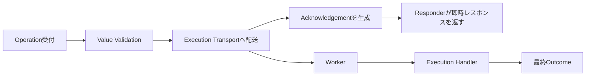
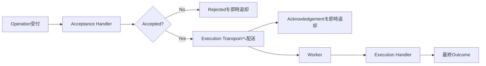
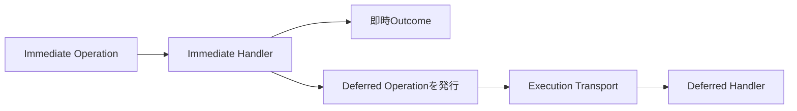
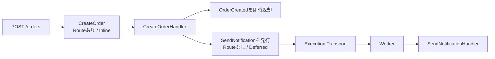
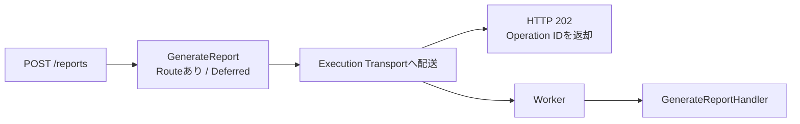

# D006: HandlerとOutcome

Status: Decided

## Context

D005により、Handlerは型付きOperationValueとExecutionContextを内包したOperation Envelopeを一つ受け取ることが決まった。

次に、Operation DefinitionからHandlerをどう解決し、Handlerの戻り値や例外をOperationの最終状態へどう変換するかを決める。

## Question 1: Handlerの関連付け

Operation DefinitionとHandlerをどのように関連付けるか。

### Options

- A: Operation Definitionへ `#[HandledBy(...)]` Attributeを付与する
- B: `CreateOrder` に対して `CreateOrderHandler` という命名規則で解決する
- C: ConfigまたはDI Containerへ対応関係を登録する

### Recommendation

Aを推奨する。

```php
#[OperationType('order.create')]
#[Accepts(CreateOrderValue::class)]
#[HandledBy(CreateOrderHandler::class)]
final class CreateOrder implements Operation
{
}
```

Operationに関する宣言をDefinitionへ集約でき、Registry構築時にHandlerの存在と型整合性を検査できる。

[ANSWER]

A、遅延評価の場合は別途Handleを用意したい。つまり、即座にレスポンスを返すHandleと後で遅延して後続処理を行うHandleを分けて管理できるようにしたい。

[/ANSWER]

## Question 2: Handlerの戻り値

Handlerの成功と業務上の拒否を、どのように表現するか。

### Options

- A: 成功時は任意のOutcomeを返し、拒否時は例外をthrowする
- B: `Completed` または `Rejected` を表すFWのResult型を返す
- C: Operationごとに自由な戻り値を許可し、Adapterが解釈する

### Recommendation

Bを推奨する。

```php
/**
 * @return OperationResult<OrderCreated>
 */
public function handle(OperationEnvelope $operation): OperationResult
{
    if (!$this->inventory->isAvailable($operation->value()->items)) {
        return OperationResult::rejected(
            RejectionReason::conflict('inventory_unavailable'),
        );
    }

    return OperationResult::completed(
        new OrderCreated($orderId),
    );
}
```

FWが戻り値から `OperationCompleted` と `OperationRejected` を確実に判定できる。

[ANSWER]

B

[/ANSWER]

## Question 3: システム障害

DB停止、通信タイムアウト、実装バグなどのシステム障害をどう表現するか。

### Options

- A: HandlerがFailed Resultを返す
- B: Handlerから例外をthrowし、FWが `AttemptFailed` として捕捉する
- C: Resultと例外の両方を同じ意味で許可する

### Recommendation

Bを推奨する。

予期された業務上の不成立はRejected Resultとして返し、正常な戻り値ではないシステム障害は例外で表す。FWは例外を捕捉し、Retry Policyに基づいて再試行または `OperationFailed` へ遷移させる。

[ANSWER]

B、これってスーパーバイザー的な考え方ですかね？

[/ANSWER]

## Question 4: 成功時のOutcome型

Operation Definitionが、成功時に返すOutcome型を宣言するか。

### Options

- A: `#[Returns(OrderCreated::class)]` Attributeで宣言する
- B: Handlerの戻り値型だけから判定する
- C: Outcome型を宣言せず、連想配列なども許可する

### Recommendation

Aを推奨する。

```php
#[Accepts(CreateOrderValue::class)]
#[HandledBy(CreateOrderHandler::class)]
#[Returns(OrderCreated::class)]
final class CreateOrder implements Operation
{
}
```

入力Value、Handler、成功Outcomeの契約をOperation Definitionへ集約できる。PHPStan拡張でHandlerの戻り値との一致も検査できる。

[ANSWER]

A

[/ANSWER]

## Question 5: Outcomeのない成功

削除処理や通知処理など、返す業務データがない成功をどう表現するか。

### Options

- A: 共通の `EmptyOutcome` を返す
- B: `OperationResult::completed()` の値を省略可能にする
- C: `null` を返す

### Recommendation

Bを推奨する。

成功状態はResult自体で表現できるため、ダミーオブジェクトや曖昧な `null` を要求せずに済む。

[ANSWER]

B

[/ANSWER]

## Question 6: HTTPレスポンスへの変換

Completed OutcomeをHTTPレスポンスへどう変換するか。

### Options

- A: OutcomeにHTTPステータスやHeaderを持たせる
- B: OperationまたはOutcome型に対応するResponderをWebアダプタが解決する
- C: FWがすべてJSON 200へ固定変換する

### Recommendation

Bを推奨する。

```text
OperationResult<OrderCreated>
    -> CreateOrderResponder
    -> HTTP 201 + JSON
```

OutcomeとHandlerをHTTPから独立させながら、Operationごとに201、204、Headerなどを設定できる。

[ANSWER]

B

[/ANSWER]

## Follow-up 1: Deferred Operationの二段階処理

Deferred Strategyで「即座にレスポンスを返すHandle」と「後で後続処理を行うHandle」を分ける場合、即時側の責務によって設計が変わる。

### Pattern A: 即時側は受付レスポンスだけを作る



この場合、即時側に業務Handlerは必要ない。FWが配送成功後にAcknowledgementを生成し、ResponderがHTTP 202などへ変換する。

### Pattern B: 配送前に同期的な業務処理を行う



Acceptance Handlerは、配送前にユーザー固有の受付判定や軽い同期処理を行う。Execution HandlerはWorkerで本処理を行う。

ただしAcceptance Handlerで業務DBを変更した後、Execution Transportへの配送に失敗すると中間状態が残る。このパターンを採用する場合、Acceptance Handlerは原則として副作用を持たない受付判定に限定するか、Transactional Outboxなどを別途設計する必要がある。

### Pattern C: 即時Operationから別のDeferred Operationを発行する



即時処理と後続処理を、それぞれ独立したOperationとして追跡する。Correlation IDとCausation IDで関係を記録できる。

### Question

想定している「二つのHandle」に最も近いものはどれか。

### Options

- A: 即時側は受付レスポンスを作るだけ。業務Handlerは後続処理に一つだけ置く
- B: 同じOperationにAcceptance HandlerとExecution Handlerの二つを持たせる
- C: Immediate OperationのHandlerから、別のDeferred Operationを発行する
- D: BとCの両方をFWで利用可能にする

### Recommendation

AとCを提供し、Bは初期スコープに含めないことを推奨する。

単なる受付応答にはHandlerを増やさず、独立した業務処理が二つある場合は別Operationとして表現する。各Operationの責務とJournalが明確になり、配送失敗時の中間状態も減らせる。

[ANSWER]

悩ましい、Cの発想は好き。Operationは単一責務として、非同期で何かを行いたい場合は非同期Operationを生成するというのは良い。そうなる場合非同期OperationにはHTTPの受け口を作れない仕様を持たないと返答が返ってこないエンドポイントが生まれませんかね？

[/ANSWER]

## Follow-up 2: Supervisorに相当する責務

システム障害としてthrowされた例外は、FWの実行境界が捕捉する。

```text
Handler throws Exception
    -> AttemptFailed
    -> Supervision Policy
       ├─ Retry
       ├─ Fail Operation
       └─ Dead Letter
```

これはAkkaのSupervisor Strategyに近い。ただし、初期設計ではActor階層や親子Actorの再起動ではなく、Operationの各Attemptに対する例外分類と再試行判断へ限定する。

具体的な例外分類、最大試行回数、Backoff、Dead LetterはExecution Policy専用の設計対話で決める。

## Follow-up 3: HTTP公開とExecution Strategy

OperationがHTTPから呼び出せるかどうかと、InlineまたはDeferredのどちらで実行するかは、別の関心事として扱える。

### 内部専用のDeferred Operation

`#[Route]` を持たないOperationは、HTTPルーターへ登録されない。

```php
#[OperationType('notification.send')]
#[Accepts(SendNotificationValue::class)]
#[HandledBy(SendNotificationHandler::class)]
#[ExecuteWith(Deferred::class)]
final class SendNotification implements Operation
{
}
```

HTTP公開されたOperationのHandlerから、この内部Operationを発行する。



### HTTP公開されたDeferred Operation

Deferred Operationに明示的な `#[Route]` がある場合はHTTPから呼び出せる。FWはExecution Handlerの完了を待たず、Execution Transportへの配送成功後にAcknowledgementを返す。



そのため、Deferred OperationがHTTP公開されていても、返答のないエンドポイントにはならない。

### Question

HTTP公開とExecution Strategyの関係をどうするか。

### Options

- A: `#[Route]` の有無でHTTP公開を決め、Execution Strategyとは独立させる
- B: Deferred Operationは常に内部専用とし、`#[Route]` を禁止する
- C: Operationとは別のEndpointクラスを作り、EndpointからOperationを発行する

### Recommendation

Aを推奨する。

通常は「RouteありInline Operationから、RouteなしDeferred Operationを発行する」構成を使える。一方、レポート生成や動画変換のように、HTTPで直接受け付けて202を返す非同期APIも自然に表現できる。

[ANSWER]

理解できました。Aで良い

[/ANSWER]

## Decision

[DECISION]

1. Operation DefinitionとHandlerは `#[HandledBy(...)]` Attributeで関連付ける。
2. 一つのOperationは一つの業務Handlerを持つ。
3. Deferred Operationの受付応答だけを生成する同期Handlerは設けない。FWがExecution Transportへの配送成功後にAcknowledgementを生成する。
4. 同期処理と非同期の後続処理がそれぞれ独立した業務責務を持つ場合、同期OperationのHandlerから別のDeferred Operationを発行する。
5. Handlerは成功または業務上の拒否を、FW標準の `OperationResult` で返す。
6. `OperationResult::completed($outcome)` は成功を表し、FWは `OperationCompleted` を記録する。
7. `OperationResult::rejected($reason)` は予期された業務上の拒否を表し、FWは `OperationRejected` を記録する。
8. システム障害はHandlerから例外としてthrowする。FWの実行境界が捕捉し、`AttemptFailed` を記録する。
9. 例外後のRetry、Operation Failed、Dead Letterの判断は、Execution Strategyに紐づくSupervision Policyへ委ねる。
10. Operation Definitionは `#[Returns(...)]` Attributeで成功時のOutcome型を宣言する。
11. 成功時に返す業務データがない場合、`OperationResult::completed()` の値を省略できる。
12. Completed OutcomeからHTTPレスポンスへの変換は、WebアダプタがOperationまたはOutcomeに対応するResponderを解決して行う。
13. OperationのHTTP公開とExecution Strategyは独立した関心事とする。
14. `#[Route]` を持たないOperationはHTTPルーターへ登録されず、内部からだけ発行できる。
15. Routeを持つDeferred Operationは、Execution Handlerの完了を待たず、配送成功後にAcknowledgementをHTTPレスポンスへ変換して返す。

[/DECISION]

## Consequences

[CONSEQUENCES]

- Operation DefinitionにValue、Handler、Outcomeの型契約が集約される。
- Registryは `#[Accepts]`、`#[HandledBy]`、`#[Returns]` の整合性を検証する必要がある。
- Handlerの戻り値からCompletedとRejectedを機械的に判定できる。
- 業務上の拒否とシステム障害が明確に分離される。
- Deferred受付応答のためだけのユーザー実装Handlerは不要になる。
- 非同期後続処理を別Operationとして表現することで、単一責務とJournal上の因果関係を維持できる。
- RouteなしDeferred Operation、RouteありInline Operation、RouteありDeferred Operationをすべて表現できる。
- `OperationResult`、Rejection Reason、Acknowledgement、Responderの具体的なAPIを設計する必要がある。
- 例外分類、Retry、Backoff、Dead LetterをSupervision Policyの設計対話で決める必要がある。

[/CONSEQUENCES]
