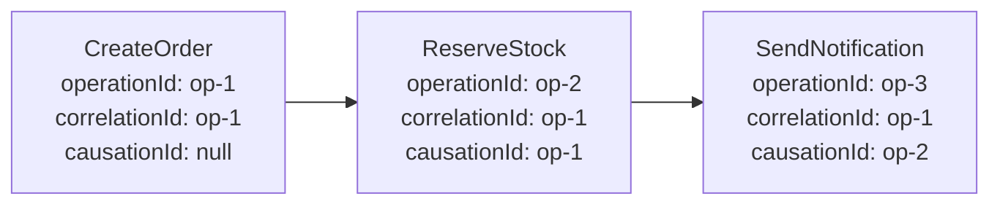

# D009: ExecutionContext

Status: Decided

## Context

D005により、HandlerはOperationValueとExecutionContextを内包した読み取り専用Operation Envelopeを受け取ることが決まった。

ExecutionContextは、Operationの追跡、連鎖、冪等性、実行制御に使うメタデータである。この設計対話では、必須フィールド、Actor情報、子Operationへの伝播、Deadlineを決める。

## Question 1: 必須フィールド

ExecutionContextが必ず持つ情報をどこまでにするか。

### Options

- A: Operation IDだけを必須にする
- B: Operation ID、Attempt ID、Correlation ID、Causation ID、受付時刻、Attempt開始時刻をコアにする
- C: Actor、Tenant、Idempotency Key、Deadlineを含むすべてを必須にする

### Recommendation

Bを推奨する。

追跡と再試行に必要な情報をコアにし、Actor、Tenant、Idempotency Key、Deadlineは存在しないOperationもあるためOptionalなContext要素として扱う。

[ANSWER]

B

[/ANSWER]

## Question 2: Actor情報

認証済みユーザーやシステム主体を、ExecutionContextへどう保持するか。

### Options

- A: 認証オブジェクト全体とTokenを保持する
- B: 安定したActor ID、Actor Type、許可された最小限の属性だけを保持する
- C: ExecutionContextにはActor情報を持たせない

### Recommendation

Bを推奨する。

```php
final readonly class ActorContext
{
    public function __construct(
        public string $id,
        public string $type,
        public array $attributes = [],
    ) {
    }
}
```

Password、Session、Bearer TokenなどのCredentialは保持・Journal記録・子Operationへの伝播を禁止する。

[ANSWER]

B、認証やミドルウェアを別途検討したい

[/ANSWER]

## Question 3: 子Operationへの伝播

Handlerが別のOperationを発行した場合、Contextをどう設定するか。

### Options

- A: 子Operationへ親のContextをそのままコピーする
- B: FWが新しいOperation IDを発行し、Correlation IDを維持、Causation IDを親Operation IDに設定する
- C: Contextを伝播せず、子Operationを完全に独立させる

### Recommendation

Bを推奨する。

```text
Parent:
  operationId   = op-1
  correlationId = corr-1

Child:
  operationId   = op-2
  correlationId = corr-1
  causationId   = op-1
```

Actor、Tenant、DeadlineなどのOptional要素は、各要素の伝播Policyに従って引き継ぐ。

[ANSWER]

Bが推奨の理由はありますか？
Aにして、常に同じOperationIdにしておくと追跡しやすくなりません？この辺はトレーサビリティとかの知見がないので教えてほしい

[/ANSWER]

## Question 4: 任意Metadata

アプリケーションが独自MetadataをExecutionContextへ追加できるようにするか。

### Options

- A: 任意の連想配列を自由に追加できる
- B: 型付けされたContext Extensionだけを登録できる
- C: FW定義のフィールド以外は追加できない

### Recommendation

Bを推奨する。

```php
interface ContextExtension
{
    public static function key(): string;
}
```

任意配列は名前衝突、シリアライズ不能値、機密情報の混入を招きやすい。ExtensionごとにSerializer、伝播Policy、Sensitive Policyを登録できるようにする。

[ANSWER]

B

[/ANSWER]

## Question 5: Deadline

Operationの実行期限をExecutionContextへ持たせるか。

### Options

- A: Optionalな絶対時刻のDeadlineを持たせ、期限超過時はHandlerを開始しない
- B: タイムアウト秒数だけを持たせ、各Attempt開始時にリセットする
- C: 初期設計ではDeadlineを持たせない

### Recommendation

Aを推奨する。

絶対時刻ならDeferred Queueで待機した時間も含めたOperation全体の期限を表現できる。子Operationへは親より長くならないように伝播する。

[ANSWER]

A

[/ANSWER]

## Question 6: Contextの不変性

Operation実行中にExecutionContextを書き換えられるようにするか。

### Options

- A: 読み取り専用とし、変更が必要な場合は新しいContextを生成する
- B: Handlerが自由に値を追加・変更できる
- C: FWフィールドは不変、独自Metadataだけ可変にする

### Recommendation

Aを推奨する。

Journal Recordと実行中のContextが食い違うことを防ぎ、並列処理でも安全に共有できる。

[ANSWER]

A

[/ANSWER]

## Follow-up 1: Operation ID、Correlation ID、Causation ID

同じユーザー要求から発生した一連の処理を追跡する役割は、Operation IDではなくCorrelation IDが担う。



Root Operationでは、Correlation IDの初期値をRootのOperation IDと同じ値にできる。子Operationは新しいOperation IDを持つが、Correlation IDで検索すれば一連の処理をまとめて取得できる。

### 同じOperation IDを共有した場合の問題

親子で同じOperation IDを使うと、次を区別できなくなる。

- どのHandlerのAttemptが失敗したか
- どのOperationがCompletedまたはRejectedになったか
- どのOperationだけをRetryまたはReplayするか
- Inbox/Deduplicationで親と子のどちらを処理済みとするか
- 親と子が並列実行された場合のJournal Entryの順序

Operation IDは「一つのOperationの生涯」、Correlation IDは「複数Operationから成る一連の処理」、Causation IDは「直接の発生原因」を表す。

これは分散トレーシングにおけるTrace IDとSpan IDに近い。

| 本FW | 分散トレーシング上の類似概念 |
| --- | --- |
| Correlation ID | Trace ID |
| Operation ID | Span IDに近い処理単位 |
| Causation ID | Parent Span IDに近い親子関係 |

完全に同じ概念ではないが、OpenTelemetryへ変換しやすい構造になる。

### Question

この役割分担で、子Operationには新しいOperation IDを発行する方針を採用するか。

### Options

- A: 採用する。RootではCorrelation IDをRoot Operation IDから初期化する
- B: 親子Operationで同じOperation IDを共有する
- C: Operation IDは分けるが、Correlation IDは使用しない

### Recommendation

Aを推奨する。

[ANSWER]

すばらしい、理解出来ました。A

[/ANSWER]

## Decision

[DECISION]

1. ExecutionContextのコアフィールドは、Operation ID、Attempt ID、Correlation ID、Causation ID、Operation受付時刻、Attempt開始時刻とする。
2. Actor、Tenant、Idempotency Key、DeadlineはOptionalなContext要素とする。
3. Actor情報は、安定したActor ID、Actor Type、明示的に許可された最小限の属性だけを保持する。
4. Password、Session、Bearer TokenなどのCredentialはExecutionContextへ保持せず、Journal記録と子Operationへの伝播を禁止する。
5. Root OperationではCorrelation IDをRootのOperation IDから初期化する。
6. 子Operationには新しいOperation IDを発行し、Correlation IDを維持し、Causation IDへ親Operation IDを設定する。
7. Actor、Tenant、DeadlineなどのOptional要素は、要素ごとの伝播Policyに従って子Operationへ引き継ぐ。
8. アプリケーション独自Metadataは、任意の連想配列ではなく、登録された型付きContext Extensionとして追加する。
9. Context ExtensionはSerializer、伝播Policy、Sensitive Policyを定義できるようにする。
10. OperationはOptionalな絶対時刻のDeadlineを持てる。期限超過時は新しいAttemptを開始しない。
11. 子Operationへ伝播するDeadlineは、親OperationのDeadlineより後の時刻にできない。
12. ExecutionContextは読み取り専用とし、変更が必要な場合は新しいContextを生成する。

[/DECISION]

## Consequences

[CONSEQUENCES]

- Correlation IDで一連のOperationを検索し、Operation IDで各処理の生涯を識別し、Causation IDで直接の因果関係を復元できる。
- 親子Operationが別々のRetry、Outcome、Deduplication状態を持てる。
- OpenTelemetryのTrace/Span構造へ対応付けやすくなる。
- 認証CredentialをDeferred TransportやJournalへ誤って流す危険を減らせる。
- Context Extensionの登録Registryと、Serializer、伝播、Sensitiveの各Policyを実装する必要がある。
- 認証・認可とActorContext生成の境界はMiddleware設計で決める必要がある。
- Deadline超過時の最終状態とJournal Entryを別途決める必要がある。

[/CONSEQUENCES]
