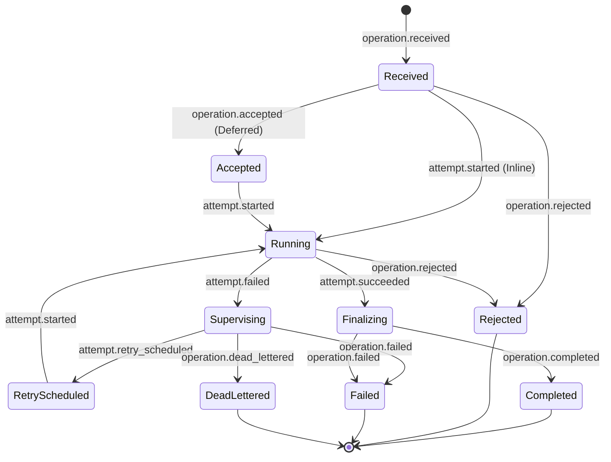

# D036: Lifecycle State Machine

Status: Decided

## Context

MVP Lifecycle Event集合とHandler Result Contractが確定した。次に、どの状態からどのEventを発行できるかを明示し、不正なJournal列とTerminal後の再実行を機械的に防止する。

Journalは事実の履歴、Lifecycle Stateはその履歴から導かれる現在状態として扱う。

## Question 1: Operation Stateと遷移

次の状態をMVPで採用するか。

```text
Received
Accepted
Running
Supervising
RetryScheduled
Finalizing
Completed       terminal
Rejected        terminal
Failed          terminal
DeadLettered    terminal
```

主要遷移：

```text
(new)          -- operation.received        -> Received
Received       -- operation.accepted        -> Accepted       # Deferredのみ
Received       -- attempt.started           -> Running        # Inline
Received       -- operation.rejected        -> Rejected
Accepted       -- attempt.started           -> Running
Running        -- attempt.succeeded         -> Finalizing
Running        -- operation.rejected        -> Rejected        # Handlerの業務拒否
Running        -- attempt.failed            -> Supervising
Supervising    -- attempt.retry_scheduled   -> RetryScheduled
Supervising    -- operation.failed          -> Failed
Supervising    -- operation.dead_lettered   -> DeadLettered
RetryScheduled -- attempt.started           -> Running
Finalizing     -- operation.completed       -> Completed
Finalizing     -- operation.failed          -> Failed
```

### Options

- A: このStateと遷移を採用する
- B: Operation Stateをもっと少なくし、Attempt Stateだけ別管理する
- C: 一部のStateまたは遷移を修正する

### Recommendation

Aを推奨する。Handler実行、Supervision判断、Retry待機、最終化を区別でき、障害がどの段階で起きたかを状態として表せる。

[ANSWER]

A
mermaidで図として残したい

[/ANSWER]

## Question 2: 不正な遷移

### Options

- A: Journal生成前に `LifecycleTransitionException` を投げ、CriticalなSystem Logを残す
- B: 警告だけ残してEventを発行する
- C: 不正Eventを無視して処理を続ける

### Recommendation

Aを推奨する。

不正遷移はユーザー業務の失敗ではなくFrameworkまたはAdapterのInvariant違反である。不正なJournalを残さず、Workerでは対象Operationを安全に停止して調査可能にする。

[ANSWER]

A

[/ANSWER]

## Question 3: 現在Stateの正本

### Options

- A: InlineはExecution Scope、Deferredは永続Operation Stateを実行時の正本とする
- B: Event発行のたびにCanonical Journal全件を読み直してStateを再構築する
- C: Journal Observerの出力先を現在Stateの正本とする

### Recommendation

Aを推奨する。

Journalからの再構築機能は診断、整合性検査、復旧に提供するが、通常実行のたびに外部Sinkを読み直さない。State更新とSequence予約は同じ競合制御下で扱う。

[ANSWER]

A

[/ANSWER]

## Question 4: Terminal後の処理

### Options

- A: Terminal Stateでは新しいLifecycle EventとHandler実行を拒否し、同一Recordの再配送だけを許可する
- B: 同じOperation IDで明示的な再実行を許可する
- C: Terminal後も重複実行としてHandlerを呼び、結果だけ破棄する

### Recommendation

Aを推奨する。

Replayは新しいOperation IDで行うという既存仕様を維持する。同一Record IDとSequenceの配送Retryは状態遷移ではないため許可する。

[ANSWER]

A

[/ANSWER]

## Decision

[DECISION]

MVPではReceived、Accepted、Running、Supervising、RetryScheduled、Finalizingと、Completed、Rejected、Failed、DeadLetteredのTerminal Stateを採用する。

状態遷移は次の図を正本とする。



不正な遷移はJournal Record生成前に `LifecycleTransitionException` を投げ、CriticalなSystem Logを残す。不正Eventは発行せず、対象Operationを安全に停止する。

通常実行における現在Stateの正本は、InlineではExecution Scope、Deferredでは永続Operation Stateとする。Journalからの再構築は診断、整合性検査、復旧に利用する。

Terminal Stateでは新しいLifecycle EventとHandler実行を拒否する。同一Record IDとSequenceによる配送Retryだけを許可し、Replayは新しいOperation IDで行う。

[/DECISION]

## Consequences

[CONSEQUENCES]

- Handler実行、Supervision、Retry待機、最終化を状態として区別できる。
- 不正なJournal列を生成前に拒否できる。
- Deferred State更新とSequence予約を同じ競合制御下で扱える。
- 外部Observerを通常実行のState Storeとして参照する必要がない。
- Terminal後の重複Handler実行を防止できる。
- Lifecycle Transition TableとJournal再構築器を実装し、図と同じ遷移をTestする必要がある。

[/CONSEQUENCES]
