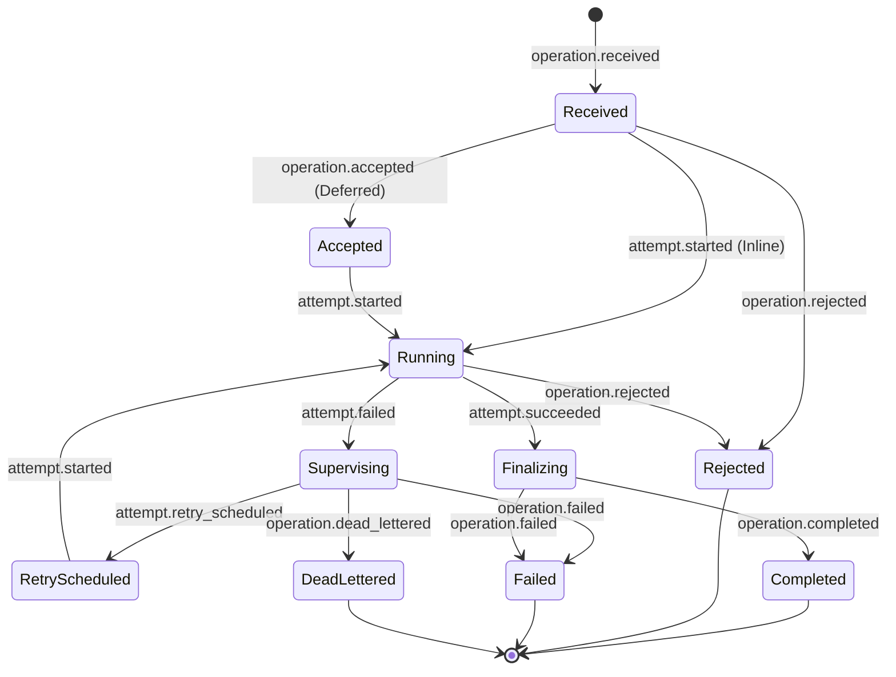

# Lifecycle State Machine

## State

MVPでは次のOperation Stateを使用する。

```text
Received
Accepted
Running
Supervising
RetryScheduled
Finalizing
Completed       terminal
Rejected        terminal
Failed          terminal
DeadLettered    terminal
```

## 状態遷移図



## 不正な遷移

不正な遷移はJournal Record生成前に `LifecycleTransitionException` を投げ、CriticalなSystem Logを残す。

不正Eventは発行せず、Workerでは対象Operationを安全に停止して調査可能にする。Invariant違反を業務上のOperation失敗として扱わない。

## 現在State

通常実行における現在Stateの正本は次とする。

- Inline：Execution Scope
- Deferred：永続Operation State

State更新とSequence予約は同じ競合制御下で扱う。

JournalからのState再構築は診断、整合性検査、復旧に提供するが、通常実行のたびに全Recordを読み直さない。

## Terminal State

Completed、Rejected、Failed、DeadLetteredでは、新しいLifecycle EventとHandler実行を拒否する。

同一Record IDとSequenceによる配送Retryは状態遷移ではないため許可する。Replayは新しいOperation IDで行う。
