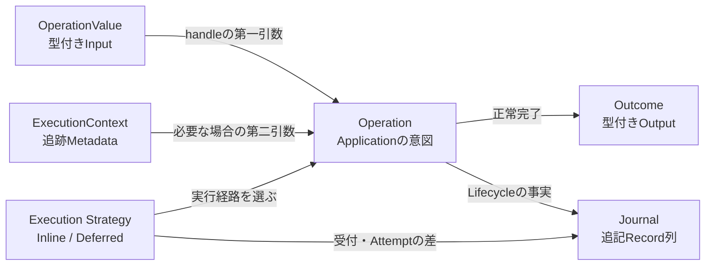

# 中核概念（Core Concepts）

BlackOpsは、Applicationの意図を表すOperationを中心に、型付きInput／Output、Execution Strategy、追跡Context、Lifecycle Journalを組み合わせます。

## 図のテキスト代替

Operationは`OperationValue`を第一引数に受け取り、必要な場合だけ`ExecutionContext`を第二引数に受け取ります。Execution Strategyは同じOperationをInlineまたはDeferredで実行する経路を選びます。正常完了すると`Outcome`を返し、受付からTerminal StateまでのLifecycle上の事実は`Journal`へ追記されます。

## Operation

Applicationが実行したい一つの意図と処理単位です。Typed Self-handled形式ではOperation自身が`handle()`を持ちます。HTTP Controller、CLI Command、WorkerはOperationを呼び出す入口であり、Operationそのものではありません。

## OperationValue

HTTP等の入力を型付きで受け取るOperation Inputです。Validationと`#[Sensitive]` Metadataの境界になります。`handle()`の第一引数には`OperationValue`を実装した具象Classを指定します。

## Outcome

Operationが正常完了したときの型付きOutputです。InlineではResponseへ変換でき、DeferredではOperation IDから後で取得できます。Presentation形式そのものではないため、HTTP Adapterは必要に応じてJSONへ変換します。

## Journal

Operation Lifecycleで起きた事実を順序付きで追記するRecord列です。Application LogやDeferred Transport Payloadとは責務が異なり、`operation.received`、`attempt.started`、`operation.completed`等をOperation IDで追跡できます。

## ExecutionContext

Operation ID、Correlation、Causation、Attempt等、追跡と伝播に必要なRead-only Metadataです。Frameworkが生成し、Operationは必要な場合だけ`handle()`の第二引数から読み取ります。

## Execution Strategy

同じOperationをRequest内で実行するInlineか、Durable受付後にWorkerが実行するDeferredかを選ぶ境界です。Strategyが変わってもOperationValue、Operation、Outcomeの型は変わりません。

次は[インストール](installation.md)からApplicationを作成します。用語をまとめて確認する場合は[Glossary](glossary.md)を参照してください。
