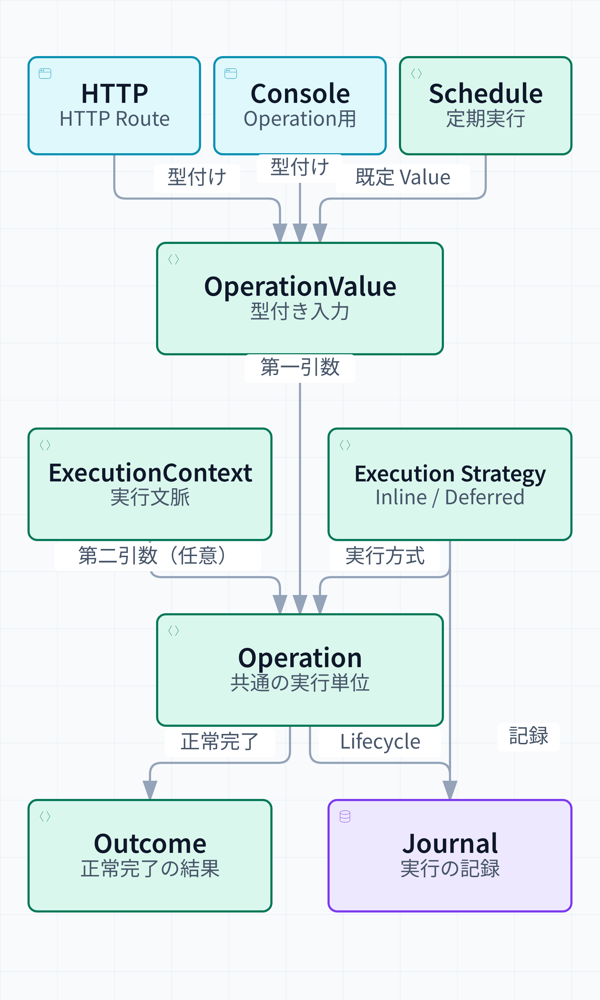

# Core Concepts

BlackOpsは、Applicationの意図を表すOperationを中心に、型付きInput／Output、Execution Strategy、追跡Context、Lifecycle Journalを組み合わせます。

Operationは`OperationValue`を第一引数に受け取り、必要な場合だけ`ExecutionContext`を第二引数に受け取ります。Execution Strategyは同じOperationをInlineまたはDeferredで実行する経路を選びます。正常完了すると`Outcome`を返し、受付からTerminal StateまでのLifecycle上の事実は`Journal`へ追記されます。

## Operation

Applicationが実行したい一つの意図と処理単位です。Typed Self-handled形式ではOperation自身が`handle()`を持ちます。HTTP Adapter、Operation用CLI、ScheduleやWorkerはOperationの実行を支える仕組みです。業務処理はOperationに記述します。

## OperationValue

HTTPやOperation用CLIからの入力を型付きで受け取るOperation Inputです。Scheduleでは引数なしで生成できるValueを使います。Validationと`#[Sensitive]` Metadataの境界になります。`handle()`の第一引数には`OperationValue`を実装した具象Classを指定します。

## Outcome

Operationが正常完了したときの型付きOutputです。InlineではResponseへ変換でき、DeferredではOperation IDから後で取得できます。Presentation形式そのものではないため、HTTP Adapterは必要に応じてJSONへ変換します。

## Journal

Operation Lifecycleで起きた事実を順序付きで追記するRecord列です。Application LogやDeferred Transport Payloadとは責務が異なり、`operation.received`、`attempt.started`、`operation.completed`等をOperation IDで追跡できます。

## ExecutionContext

Operation ID、Correlation、Causation、Attempt等、追跡と伝播に必要なRead-only Metadataです。Frameworkが生成し、Operationは必要な場合だけ`handle()`の第二引数から読み取ります。

## Execution Strategy

同じOperationをRequest内で実行するInlineか、Durable受付後にWorkerが実行するDeferredかを選ぶ境界です。Strategyが変わってもOperationValue、Operation、Outcomeの型は変わりません。

## 入口からOperationへ

[Inline and Deferred](execution.md)で扱うHTTP Routeと[ConsoleCommand](console-command.md)は、入力を`OperationValue`へ変換してから実行経路を選びます。
[Scheduled Operation](scheduled-operation.md)は予定時刻を評価し、設定された実行戦略に従ってValueと実行Contextを用意します。
この図は共通する概念の役割を示しており、すべての入口が同じ順序で入力を組み立てるわけではありません。

Inlineは受付元のプロセスでOperationを実行します。
DeferredはValueとContextをDurable Transportへ保存し、Workerが取得して同じOperationを実行します。
どちらも正常完了時に`Outcome`を返し、Lifecycleの事実をJournalへ記録します。
HTTPのInline実行では、そのOutcomeをHTTP Responseへ変換します。

次は[Lifecycle](operation-lifecycle.md)で受付、Attempt、Retry、Terminal Stateの違いを確認し、[Journal](journal.md)でCanonicalとObservedの記録境界を確認します。用語をまとめて確認する場合は[Glossary](glossary.md)を参照してください。

## 次に受付と完了を動かす

InlineとDeferredの受付・完了境界は、[Inline and Deferred](execution.md)でHTTPとWorkerの順に確認します。
