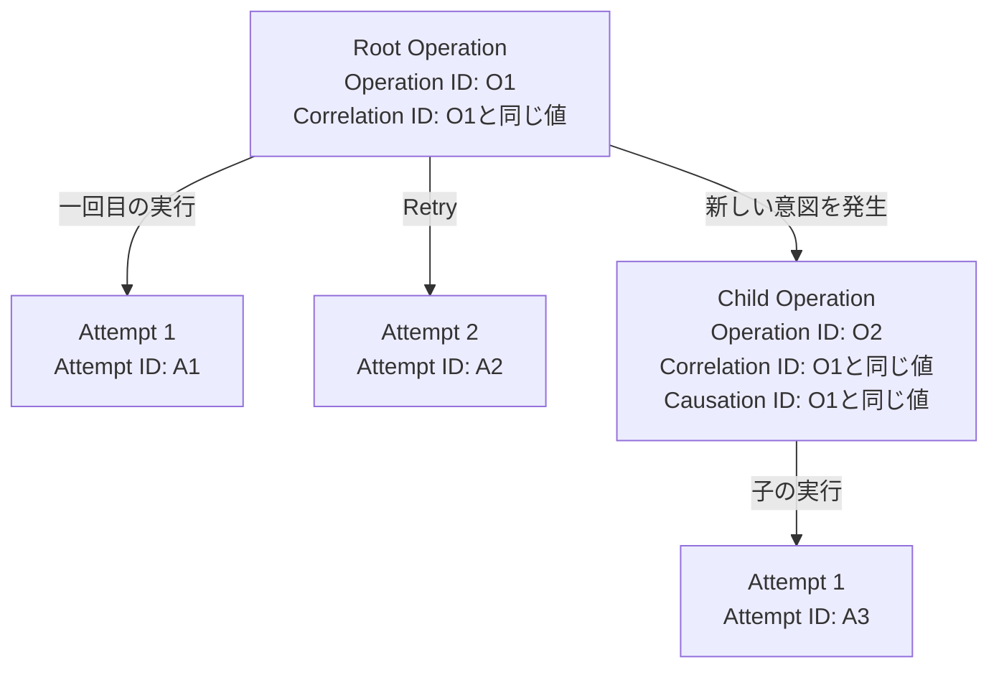

# 実行Context（ExecutionContext）

`ExecutionContext`は[Operation](glossary.md#operation)の追跡情報を保持するRead-onlyなPublic APIです。Operationが必要とする場合だけTyped Self-handled `handle()`の第二引数へ指定します。

```php
use BlackOps\Core\ExecutionContext;

public function handle(ProcessPaymentValue $value, ExecutionContext $context): PaymentProcessed
{
    $operationId = $context->operationId();
    $correlationId = $context->correlationId();
    $attempt = $context->attempt();
    $actors = $context->actorContext();

    return new PaymentProcessed($operationId->toString());
}
```

## 読み取れる情報

- `operationId()`: 現在のOperation ID
- `receivedAt()`: 受付時刻。UTCへ正規化される
- `correlationId()`: 関連OperationをまとめるCorrelation ID
- `causationId()`: 原因となるOperationがある場合のID
- `attempt()`: Deferred Attempt。Inlineでは`null`
- `deadline()`: Deadlineが構成されている場合のUTC時刻
- `actorContext()`: Operationの原因、認可対象、実行主体。Actor未設定の経路では`null`

ContextはFrameworkが生成し、ApplicationはGetterで読み取ります。公開`with...()` Methodはありません。

## Actor Context

`ActorContext`は「誰が起点か」「誰の権限を評価するか」「どのSystemが実行したか」を分けて保持します。

| Getter | 意味 | Nullable |
| --- | --- | --- |
| `origin()` | Operationの原因となった主体 | Yes |
| `authorization()` | 現在の権限を評価する主体 | Yes |
| `execution()` | 実際に処理を実行するApplication／Worker主体 | No |

各Actorは`ActorRef`の`id()`と`type()`だけを持ちます。Password、Session ID、Bearer Token、API Key、Role、Permission、ClaimはExecutionContextやDeferred Transportへ保存しません。Policy等で詳細が必要な場合は、Actor ID／Typeを使ってApplication Serviceから現在の情報を取得します。

Deferred Workerはoriginとauthorizationを維持し、executionだけをWorker System Actorへ置き換えます。この分離により、User起点の処理をWorkerが実行しても、元Userの権限をWorker自身の権限へ強化しません。

## Identifierの関係



| Identifier | 関係 |
| --- | --- |
| Operation ID | Operationごとに一つ発行し、Retryしても変わりません。 |
| Attempt ID | Handlerを実行するAttemptごとに新しく発行します。 |
| Correlation ID | Rootと子Operationを同じTraceへまとめ、子へ引き継ぎます。RootではOperation IDと同じUUID値を別の型で保持します。 |
| Causation ID | 子Operationを発生させた親Operation IDと同じUUID値を別の型で保持します。Rootでは`null`です。 |

Identifierは同じUUID値を共有する場合でも別のPHP型です。Operation IDをCorrelation IDやCausation IDの引数へそのまま渡すことはできません。RetryではOperation IDとCorrelation IDを維持し、Attempt IDだけが変わります。

## InlineとDeferred

Inline ContextにもOperation IDがありますが、Deferred Claimではないため`attempt()`は`null`です。Deferred Workerでは現在のAttempt Numberや開始情報を`AttemptContext`から読めます。

OperationがContextを使わない場合は第二引数を省略してください。第一引数は常に具象`OperationValue`であり、Contextだけを受け取るSignatureはBuildで拒否されます。
