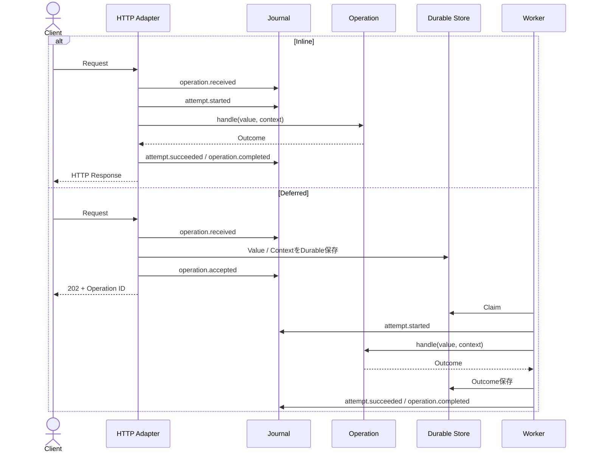

# HTTP、Inline、Deferredの実行

Operationの実行経路はDirectoryではなくMetadataで決まります。HTTP Routeを持つOperationはCompile済みHTTP Manifestへ登録され、Execution Strategyを指定しない場合はInline、`Deferred`を指定した場合はDurable受付になります。



InlineはHTTP Request内で`operation.received`から直接Attemptを開始し、OperationのOutcomeをHTTP Responseへ変換して返します。DeferredはValueとContextをDurable Storeへ保存し、`operation.accepted`の後にHTTP 202とOperation IDを返します。Workerは後から[Claim](glossary.md#claim)を取得し、Attempt、Outcome保存、完了Journalを実行します。

## Transactional Outboxへの登録

Application MutationとDeferred child Operationを同じFramework管理Transactionへ結び付ける場合は、`TransactionalOutbox`をConstructor Injectionします。

```php
use BlackOps\Core\Operation;
use BlackOps\Database\Attribute\Transactional;
use BlackOps\Outbox\TransactionalOutbox;

readonly class PlaceOrder implements Operation
{
    public function __construct(
        private OrderRepository $orders,
        private TransactionalOutbox $outbox,
    ) {}

    #[Transactional(connection: 'app')]
    public function handle(PlaceOrderValue $value): OrderPlaced
    {
        $this->orders->place($value->orderId);
        $this->outbox->register(
            new NotifyOrderOwner(),
            new NotifyOrderOwnerValue($value->orderId),
        );

        return new OrderPlaced($value->orderId);
    }
}
```

`NotifyOrderOwner`はDeferred Strategyとして登録します。Outboxへ登録できるのはDeferred child Operationだけです。親OperationのExecution ContextからCorrelation／Causation／Actor／Deadlineを継承し、親Idempotency Key Hashは子へ渡しません。OutboxはApplication Database ConfigurationのFramework Named Connectionと同じConnection Instanceを所有するFramework管理Transaction内でのみ動作します。Transaction外、別Connectionが最上位にある場合、Manual Transactionによるnesting変更／commit、または所有者不明のTransactionではFail-fastし、Direct TransportへFallbackしません。同じConnectionのNested Requiredは外側のScopeへ参加できます。

MutationとOutbox Rowは最外Commitで同時に残ります。ThrowableまたはInsert Failureでは両方Rollbackされ、Nested Requiredの途中でRollback-onlyになった場合も最外ScopeがRollbackするためRowは残りません。登録結果はOutbox Record ID、child Operation ID、UTC登録時刻だけを公開します。

現在のTransactional Outbox CapabilityはOutbox PersistenceとClaim前の`pending` Stateまでを提供します。Relay、Retry、Dead Letter、Replayは後続機能であり、この段階では送信完了を表現しません。Outboxを使わないDeferred呼出は既存Direct Transportの受付契約を維持します。

MutationのPOST／PUT／PATCH／DELETEでは、認証・認可後にOptional `Idempotency-Key`をAtomic Claimします。同じFingerprintのTerminal ResultはTyped Resultまたは安全なHTTP Responseとして再利用し、Replay Responseだけに`Idempotency-Replayed: true`と`Cache-Control: private, no-store`を投影します。GET／HEAD、Anonymous Actor、Ephemeral OutcomeではKeyを受理しません。

Malformed Key、複数Key、未対応Method、Anonymous Actor、Ephemeral OutcomeはClaim前に安全な4xxとして拒否します。異なるFingerprintや既存のIn-Progress ClaimはConflictとして扱い、既存結果がなく期限切れなら再実行せずHTTP 409の安定Code `idempotency_expired`を返します。Key付きHandlerがThrowableを投げた場合はFailure Boundaryが内部詳細を保存せず安全な失敗結果をJournalへ確定し、同じKeyの再送はHandlerを再実行せずその失敗結果をReplayします。

## Inline HTTP

```php
use BlackOps\Core\Attribute\OperationType;
use BlackOps\Core\Operation;
use BlackOps\Http\Attribute\Route;

#[Route(method: 'GET', path: '/welcome')]
#[OperationType('welcome.show')]
final readonly class ShowWelcome implements Operation
{
    public function handle(WelcomeValue $value): WelcomeShown
    {
        return new WelcomeShown('Welcome to BlackOps');
    }
}
```

HTTP HandlerはCompile済みRouteを照合し、RequestをValueへBindして、ContainerからOperationを解決します。Handler実行とLifecycle JournalをRequest内で完了し、OutcomeをHTTP Responseへ変換します。

## Deferred HTTP

```php
use BlackOps\Core\Attribute\ExecuteWith;
use BlackOps\Core\Attribute\OperationType;
use BlackOps\Core\Execution\Deferred;
use BlackOps\Core\ExecutionContext;
use BlackOps\Core\Operation;
use BlackOps\Http\Attribute\Route;

#[Route(method: 'POST', path: '/reports')]
#[OperationType('report.generate')]
#[ExecuteWith(Deferred::class)]
final readonly class GenerateReport implements Operation
{
    public function handle(GenerateReportValue $value, ExecutionContext $context): ReportGenerated
    {
        return new ReportGenerated($value->reportName, $context->operationId()->toString());
    }
}
```

Deferred RouteはHTTP 202とOperation IDを返し、HandlerをHTTP Process内で実行しません。Operation Value、Context、受付JournalをPostgreSQLへDurableに保存します。

## Frontendから受付と完了を分ける

Generated Operation Objectは三つの異なる操作を明示します。

| Method | 通信 | Result |
| --- | --- | --- |
| `.fetch(value, options)` | Operation Routeへ1 Request | Inline完了、またはDeferred受付202。自動Pollingしない |
| `.status(operationId, options)` | Status Resourceへ1 GET | 7 Lifecycle State、または401／404／410／500／Transport Failure |
| `.wait(operationId, options)` | `Retry-After`に従う有限のStatus GET | Completed／Rejected／Failed／Dead Lettered、またはFailure |

```ts
const accepted = await GenerateReport.fetch(value, options);

if (accepted.ok && accepted.kind === 'accepted') {
  const current = await GenerateReport.status(accepted.data.operationId, options);
  const controller = new AbortController();
  const terminal = await GenerateReport.wait(accepted.data.operationId, {
    ...options,
    signal: controller.signal,
    maxWaitMilliseconds: 15_000,
  });

  void current;
  void terminal;
}
```

`.wait()`は正のSafe Integer Deadlineと購読可能なAbort Signalを必須にします。Non-terminalだけをServerの正整数`Retry-After`に従って再取得し、401、404、410、500、Network Error、不正Responseでは停止します。無限待機、独自Backoff、Global Mutable Clientは提供しません。

## Worker

BlackOps CLIからWorkerを起動します。

```bash
php blackops worker:run --idle-sleep-milliseconds=1000
```

Workerは期限切れAttemptをRecoveryしてから[Claim](glossary.md#claim)し、一度に最大1 Claimを処理します。Smoke Testでは`--iterations=N`でLoop回数を制限できます。常駐ProcessはProcess ManagerまたはCompose Worker Profileで監督してください。

PCNTL [Heartbeat](glossary.md#heartbeat)はHandler実行中だけ[Lease](glossary.md#lease)を更新します。Heartbeat間隔はLeaseより短い正数にし、Heartbeat用DBAL ConnectionをClaim／Settlement用Connectionと分離します。

`SIGTERM`／`SIGINT`では新しいClaimを停止し、Grace Period内で実行中Handlerの完了を待ちます。Heartbeat失敗やGrace Timeout時はClaimを成功扱いせず、Lease ExpiryとRecoveryへ委ねます。

## Runtime Boundary

HTTPとWorkerはCompile済みOperation Manifest、HTTP Manifest、DI Containerだけを読み込みます。Runtime起動時にSource Discovery、Artifact Compile、Database MigrationへFallbackしません。Artifact不足、Schema Version不正、Build ID不一致は起動エラーです。

BuildとRuntimeの入口は[BlackOps CLI](project-cli.md)、Contextの読み取りは[Execution Context](execution-context.md)を参照してください。
