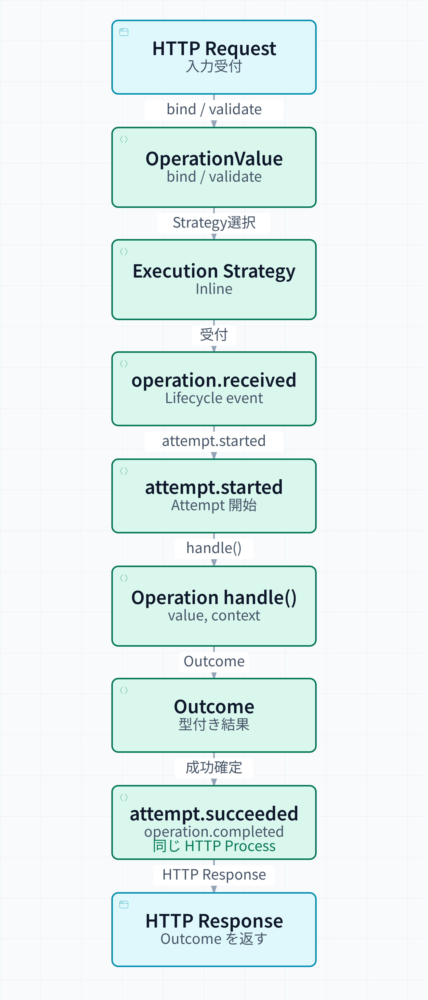
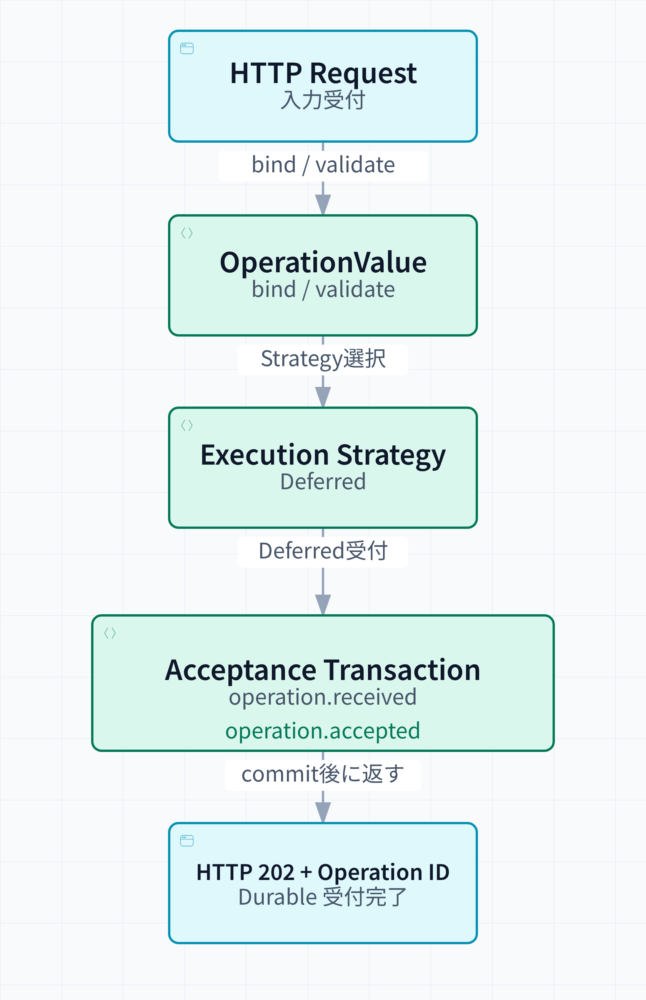
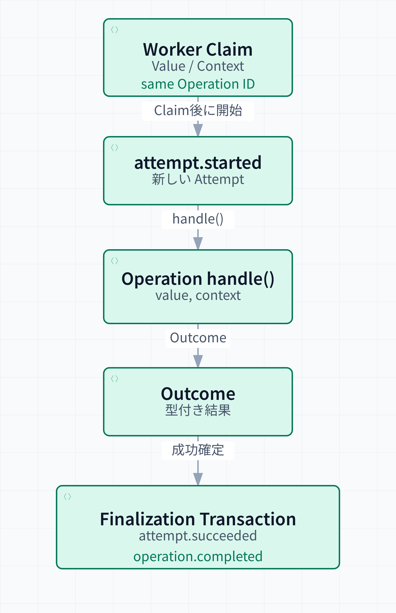

# Inline and Deferred

Operationの実行経路はDirectoryではなくMetadataで決まります。HTTP Routeを持つOperationはCompile済みHTTP Manifestへ登録され、Execution Strategyを指定しない場合はInline、`Deferred`を指定した場合はDurable受付になります。

HTTPの正常系では、RequestをValueへ変換・検証し、実行戦略を判定してからOperationの受付を記録します。
受付元で完了まで進むInlineと、受付後にWorkerが引き継ぐDeferredを分けて確認します。

### Inlineの正常完了

<div class="archify-figure">



</div>

InlineはHTTPプロセス内でAttemptを開始し、Operationの正常完了を記録してからOutcomeをHTTP Responseへ変換します。
`attempt.succeeded`、`operation.completed`の順にJournalへ記録し、Outcome Recordは作成しません。

### Deferredの受付

<div class="archify-figure">



</div>

DeferredはValue・Contextと受付Journalを同じTransactionで保存し、受付の確定後にHTTP 202とOperation IDを返します。
HTTP 202は受付済みを示し、処理の完了は待ちません。

### Workerによる実行と完了

<div class="archify-figure">



</div>

別プロセスのWorkerが[Claim](glossary.md#claim)してAttemptを開始し、同じOperationを実行します。
正常完了時は、Outcomeの保存と`attempt.succeeded`、`operation.completed`を同じTransactionで確定します。
Outcomeだけを先に確定する処理ではありません。
受付の確定後はHTTP応答とWorker実行が並行し得るため、この三つの図は実際の所要時間や待機順を表していません。

## Transactional Outboxへの登録

Application MutationとDeferred child Operationを同じTransactionへ結び付けると、最外Commitまで業務変更とDispatchが確定しません。同じConnectionのNested Required、at-least-once Relay、Retry／Backoff、Lease／Fencing、Dead Letter再開が耐久性の境界になります。Transaction外のDirect TransportへのFallback、Exactly Once、External Brokerは提供しません。

OutboxのApplication-owned完全Recipe、`Operations::dispatch()`の署名、Commit／Rollbackの確認、Relay／Worker／Retry／Dead Letterの実行手順は、重複した断片を作らず[Outbox](outbox.md)へ集約しています。ここではInline／Deferredの実行モデルとOutboxを選ぶ判断だけを扱います。

## Inline HTTP

```php
use BlackOps\Core\Attribute\OperationType;
use BlackOps\Core\Operation;
use BlackOps\Http\Attribute\Route;

#[Route(method: 'GET', path: '/welcome')]
#[OperationType('welcome.show')]
final readonly class ShowWelcome implements Operation
{
    public function handle(WelcomeValue $value): WelcomeShown
    {
        return new WelcomeShown('Welcome to BlackOps');
    }
}
```

HTTP HandlerはCompile済みRouteを照合し、RequestをValueへBindして、ContainerからOperationを解決します。Handler実行とLifecycle JournalをRequest内で完了し、OutcomeをHTTP Responseへ変換します。

## Deferred HTTP

```php
use BlackOps\Core\Attribute\Deferred;
use BlackOps\Core\Attribute\OperationType;
use BlackOps\Core\ExecutionContext;
use BlackOps\Core\Operation;
use BlackOps\Http\Attribute\Route;

#[Route(method: 'POST', path: '/reports')]
#[OperationType('report.generate')]
#[Deferred]
final readonly class GenerateReport implements Operation
{
    public function handle(GenerateReportValue $value, ExecutionContext $context): ReportGenerated
    {
        return new ReportGenerated($value->reportName, $context->operationId()->toString());
    }
}
```

Deferred RouteはHTTP 202とOperation IDを返し、HandlerをHTTP Process内で実行しません。Operation Value、Context、受付JournalをPostgreSQLへDurableに保存します。

## Frontendから受付と完了を分ける

Generated Operation Objectは三つの異なる操作を明示します。

| Method | 通信 | Result |
| --- | --- | --- |
| `.fetch(value, options)` | Operation Routeへ1 Request | Inline完了、またはDeferred受付202。自動Pollingしない |
| `.status(operationId, options)` | Status Resourceへ1 GET | 7 Lifecycle State、または401／404／410／500／Transport Failure |
| `.wait(operationId, options)` | `Retry-After`に従う有限のStatus GET | Completed／Rejected／Failed／Dead Lettered、またはFailure |

```ts
const accepted = await GenerateReport.fetch(value, options);

if (accepted.ok && accepted.kind === 'accepted') {
  const current = await GenerateReport.status(accepted.data.operationId, options);
  const controller = new AbortController();
  const terminal = await GenerateReport.wait(accepted.data.operationId, {
    ...options,
    signal: controller.signal,
    maxWaitMilliseconds: 15_000,
  });

  void current;
  void terminal;
}
```

`.wait()`は正のSafe Integer Deadlineと購読可能なAbort Signalを必須にします。Non-terminalだけをServerの正整数`Retry-After`に従って再取得し、401、404、410、500、Network Error、不正Responseでは停止します。無限待機、独自Backoff、Global Mutable Clientは提供しません。

## Worker

BlackOps CLIからWorkerを起動します。

```bash
php blackops worker:run --idle-sleep-milliseconds=1000
```

Workerは期限切れAttemptをRecoveryしてから[Claim](glossary.md#claim)し、一度に最大1 Claimを処理します。Smoke Testでは`--iterations=N`でLoop回数を制限できます。常駐ProcessはProcess ManagerまたはCompose Worker Profileで監督してください。

PCNTL [Heartbeat](glossary.md#heartbeat)はHandler実行中だけ[Lease](glossary.md#lease)を更新します。Heartbeat間隔はLeaseより短い正数にし、Heartbeat用DBAL ConnectionをClaim／Settlement用Connectionと分離します。

`SIGTERM`／`SIGINT`では新しいClaimを停止し、Grace Period内で実行中Handlerの完了を待ちます。Heartbeat失敗やGrace Timeout時はClaimを成功扱いせず、Lease ExpiryとRecoveryへ委ねます。

## Runtimeの境界

HTTPとWorkerはCompile済みOperation Manifest、HTTP Manifest、DI Containerだけを読み込みます。Runtime起動時にSource Discovery、Artifact Compile、Database MigrationへFallbackしません。Artifact不足、Schema Version不正、Build ID不一致は起動エラーです。

BuildとRuntimeの入口は[BlackOps CLI](project-cli.md)、Contextの読み取りは[Execution Context](execution-context.md)を参照してください。

定期実行も同じLifecycleを使います。[Scheduled Operation](scheduled-operation.md)のInlineは通常Dispatcher、Deferredは通常Acceptance／Transport／Workerへ接続されます。`ScheduledBy`だけでDeferredへ変わることはありません。

## 次に状態遷移を読む

受付後の状態とRetryの意味は、[Lifecycle](operation-lifecycle.md)で遷移として整理します。
