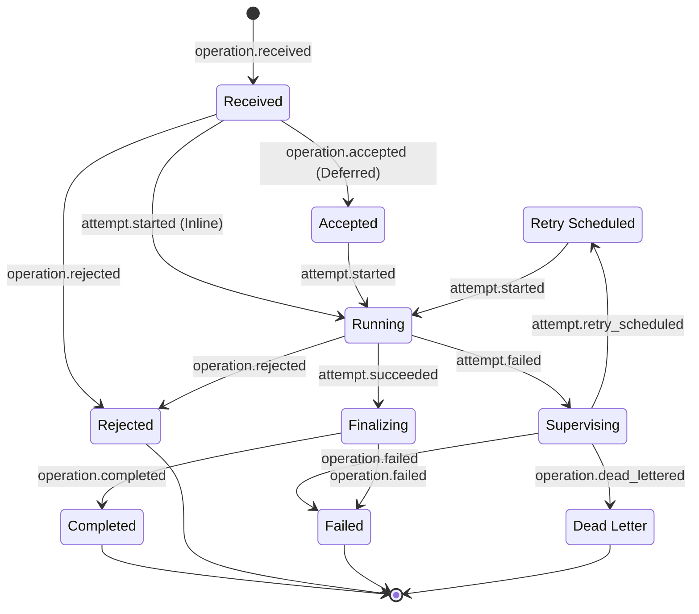

# Operation Lifecycleを理解する

BlackOpsはInlineとDeferredを同じLifecycle Modelで記録します。ApplicationはOperation IDを相関Keyとして受付からTerminal Stateまで追跡できます。

## 共通Lifecycle

正常完了するOperationはReceived、Running、Finalizing、Completedの順に進みます。DeferredだけはDurable受付後にAcceptedを経由します。

| 経路 | 状態遷移 |
| --- | --- |
| Inline成功 | Received → Running → Finalizing → Completed |
| Deferred成功 | Received → Accepted → Running → Finalizing → Completed |
| 業務拒否 | ReceivedまたはRunning → Rejected |
| Retry | Running → Supervising → Retry Scheduled → Running |
| 最終失敗 | Running → Supervising → Failed |
| Deferred隔離 | Running → Supervising → Dead Letter |

InlineはAcceptedを通らず、Request内で[Attempt](glossary.md#attempt)を開始します。DeferredだけがDurable受付後にAcceptedとなり、別ProcessのWorkerが[Claim](glossary.md#claim)してAttemptを開始します。Completed、Rejected、Failed、Dead LetterはTerminalであり、新しいLifecycle EventやHandler実行へ進みません。

## Rejected

`OperationRejectedException`は予期された業務拒否です。FrameworkはRejected ResultとTerminal Lifecycleへ変換します。Validation、Authorization、Not Found、Conflict、Business Ruleを安定したCategory／Codeで表現します。

## RetryとFailure

Retryable ExceptionはSupervision Policyに従い`attempt.failed`と`attempt.retry_scheduled`を記録します。次のWorker Attemptが同じOperationを再Claimします。Retry上限を超えた処理はFailed／[Dead Letter](glossary.md#dead-letter)へ進みます。

通常のException、Worker Interrupt、Claim Lossは業務拒否として扱いません。[Lease](glossary.md#lease)、[Heartbeat](glossary.md#heartbeat)、[Fencing Token](glossary.md#fencing-token)により、古いWorkerが成功を確定しないようにします。

## Outcome

CompletedだけがTyped Outcomeを保存します。Rejected、Failed、Retry Scheduled、Dead Letter、Claim LostはOutcome Recordを作成しません。詳細は[Outcome Retrieval](outcome-retrieval.md)を参照してください。

JournalとOutcomeは別々の保持期間を設定できます。Operation単位のHoldと安全なPurgeについては[Data Retention](retention.md)を参照してください。

仕組みを理解したら[Installation](installation.md)からApplicationを作成します。
