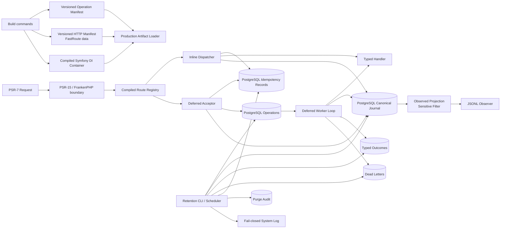
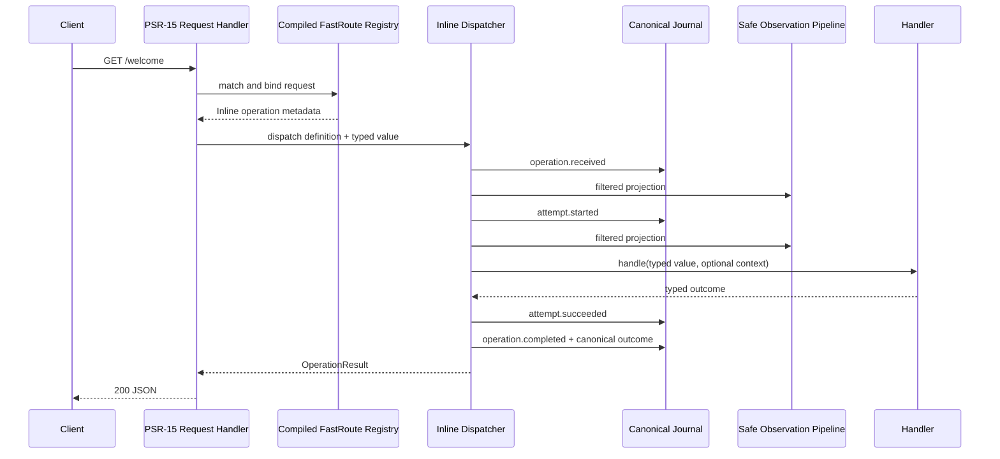
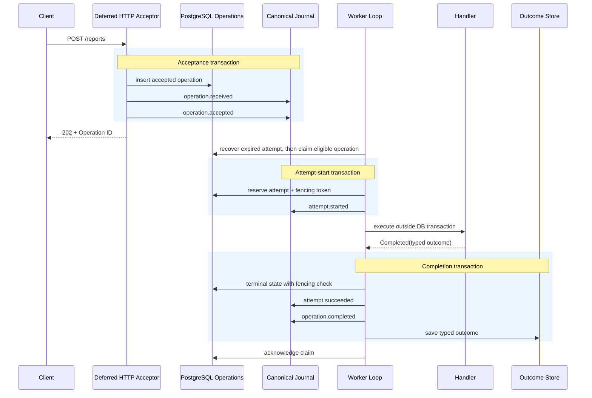

# Architecture

BlackOps is an operation-driven PHP framework. HTTP is one adapter into a typed Operation model; Inline and Deferred strategies share identifiers, metadata, handlers, outcomes, and Canonical Journal records.

## System Overview



Build-time discovery and compilation are separated from runtime loading. Production startup fails on missing, malformed, unsupported, or cross-build artifacts and does not fall back to source scanning or container compilation.

Core and public contracts do not depend on `BlackOps\Internal`. Deptrac checks namespace dependency direction, while the Public API architecture test rejects Internal types in marked public signatures.

## Inline Sequence



Canonical append succeeds before its observation is dispatched. Observer behavior follows its configured delivery policy. Canonical Received data may preserve sensitive input for reproducibility; the Observed projection is filtered before JSONL output.

## Deferred Sequence and Transaction Boundaries



The handler does not hold the lifecycle transaction open. A dedicated heartbeat DBAL connection extends the lease during handler execution; the lifecycle connection owns state, journal, outcome, and settlement work.

## Handler Failure and Recovery

```mermaid
sequenceDiagram
    participant Loop as Worker Loop
    participant DB as Operations / Lease
    participant Journal as Canonical Journal
    participant Handler
    participant Heartbeat as Dedicated Heartbeat Connection

    Loop->>DB: claim
    Loop->>DB: commit attempt start
    Loop->>Handler: execute with signal heartbeat guard
    Heartbeat->>DB: extend lease with fencing token
    alt Retryable handler exception
        Handler--xLoop: exception
        rect rgb(255, 242, 230)
            Note over Loop,Journal: Supervision transaction
            Loop->>Journal: attempt.failed
            Loop->>Journal: attempt.retry_scheduled
            Loop->>DB: retry_scheduled + available_at
        end
        Note over Loop: supervised failure may continue loop
    else Retry exhausted / dead-letter policy
        Handler--xLoop: exception
        rect rgb(255, 242, 230)
            Loop->>Journal: attempt.failed
            Loop->>Journal: operation.dead_lettered
            Loop->>DB: terminal dead_lettered + dead-letter index
        end
    else Heartbeat loss, crash, or grace timeout
        Heartbeat--xLoop: interrupt / process disappears
        Note over Loop: no supervision, acknowledge, or release
        Loop->>DB: lease remains until expiry
        Note over DB: another worker iteration
        DB->>DB: fence and recover expired attempt
        DB->>Journal: attempt.failed (lease expired)
        DB->>DB: retry schedule or terminal decision
    end
```

Only supervised handler failures are eligible for loop continuation. Claim, metadata, transaction, recovery, and settlement failures terminate the worker. Stale workers cannot commit completion after losing the fencing token.

## Idempotency Boundary

Keyed mutation requests claim a scope only after authentication and
authorization. The idempotency store owns the unique scope boundary, typed
result projection, safe HTTP snapshot, and processing-to-terminal transition.
Duplicate decisions never invoke the handler again. A complete canonical
journal can be used by the internal recovery service to reconstruct a terminal
result or deferred acceptance. Insufficient but valid evidence leaves a record
processing for later inspection; corrupt or contradictory evidence becomes a
safe internal failure.

## Retention Boundary

Retention planning is read-only. Confirmed purge rechecks Active Hold and target freshness before changing data. Each deletion/tombstone and Database Purge Audit are in one transaction. The audit decorator calls the Database Audit first and the payload-free PSR-3 System Log second; logger failure rolls the database transaction back.

Retention holds and purge audits retain typed Operation IDs without a foreign key to Operations so Inline operations and idempotency records can be protected and audited. Retention services do not delete Operations rows. Idempotency records are a fifth independent target and are deleted only after terminal eligibility and hold rechecks.

## Extension and Ownership Boundaries

- Applications own DB connections, credentials, provider config, console registration, environment loading, and deployment.
- Framework adapters expose PostgreSQL, Monolog JSONL, FastRoute, Symfony DI, Nyholm PSR-7, and FrankenPHP reference integrations.
- Production migrations are explicit deployment commands; HTTP and workers never run DDL automatically.
- Authentication, authorization, encryption, remote observability, queue adapters, and outbox relay are post-MVP extension work.
