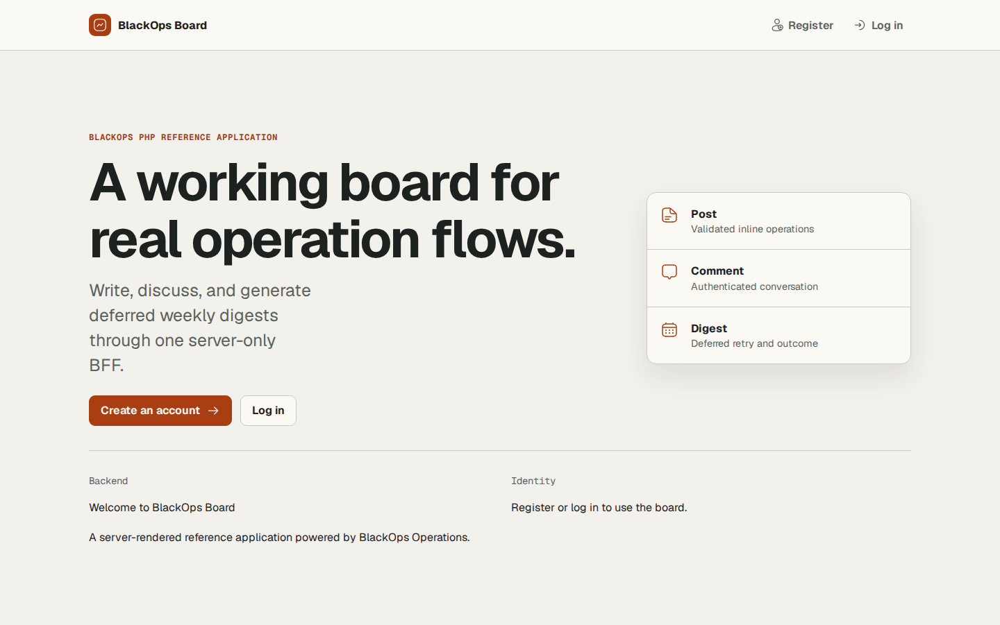

# BlackOps Board

BlackOps Board is the full-stack reference application for the repository `main` branch. It combines a BlackOps PHP backend, an Application-owned authentication boundary, PostgreSQL, a Deferred Worker, and a SvelteKit same-origin BFF. It is independent from the minimal `examples/quickstart/` application and is never copied into `blackops/skeleton`.



Use the Quickstart when you want the shortest Framework contract check. Use BlackOps Board when you want to see login, authorization, domain layering, generated server-only Operations, Inline mutations, Deferred progress, and an accessible Browser UI working together.

## Clean local setup

Run these commands from `examples/community-board/`. The sequence starts from no `.env`, dependency directory, generated contract, runtime artifact, or database volume. `bin/setup` only creates `.env` from `.env.example` when needed and prepares runtime directories; each later side effect remains an explicit command.

```bash
php bin/setup
docker compose build app http frontend
docker compose run --rm --no-deps app composer install --no-interaction --prefer-dist --no-progress
mise exec -- pnpm --dir frontend install --frozen-lockfile
docker compose up -d postgres
docker compose run --rm app php blackops database:migrate
docker compose run --rm app php blackops build:compile
docker compose run --rm app php blackops frontend:generate
docker compose run --rm app php blackops frontend:check
docker compose run --rm app php blackops app:seed
mise exec -- pnpm --dir frontend run check
mise exec -- pnpm --dir frontend run test
mise exec -- pnpm --dir frontend run build
docker compose --profile worker up -d postgres http frontend worker
```

The locked Composer path repository points to `../..`; do not copy Framework source into this application. The seed command is repeat-safe. It creates three fixed local users, three posts, and four comments without creating a session or dispatching a BlackOps Operation.

Log in at `http://localhost:5173/login` with:

```text
Email: ada@blackops.local
Password: BlackOpsBoardDemo!2026
```

This is a public Local／Test Fixture, not a production secret. Change or remove it before adapting the example for a non-local environment. Login sends the password to the Application-owned authentication route and creates the session normally; seed does not bypass authentication.

## Follow the browser journey

The browser talks only to `http://localhost:5173`. `http://localhost:8081` exposes the PHP runtime for local debugging, but the Product UI never calls it directly.

| URL or action | Input | Expected result |
| --- | --- | --- |
| `/login` | Public Local／Test Fixture above | Redirect to `/me`; one HttpOnly session is created |
| `/posts` | Open after login | Three seeded posts and their authors appear |
| `/posts/019b1000-0001-7000-8000-000000000101` | Open the seeded welcome post | Ada owns the post; Grace and Linus comments appear in order |
| `/posts/new` | Enter a title and body | Inline create returns the new detail page; blank fields show associated validation errors |
| Post detail | Add a comment | Inline comment create returns the detail with the new comment |
| Owned post detail | Edit or delete | Owner action succeeds; another user receives the same safe 404 as an unknown post |
| `/digests` | Enter `2026-W30` | Deferred request returns 202 and redirects to the progress page |
| Digest progress | Keep the Worker running | UI moves through accepted／running and then completed; a retry state appears when the local failure adapter is enabled |
| Digest detail | Follow the completed result | Immutable typed outcome displays the ISO week, post count, comment count, and generated time |

To demonstrate a real retry locally, stop the runtime, set `DIGEST_FAIL_FIRST_ATTEMPT=true` in `.env`, and start the Worker profile again. The adapter fails Attempt 1 only in the explicit Development／Test composition. Leave the default `false` for the ordinary runtime.

## Understand the runtime boundary

```text
Browser
  -> SvelteKit :5173
     -> page server load / form action / same-origin wait endpoint
        -> Application-owned *.server.ts wrapper
           -> server-only generated Operation object
              -> BlackOps PHP HTTP runtime
                 -> Application Domain + Doctrine DBAL -> PostgreSQL
                 -> Deferred transport -> Worker -> typed Outcome

SvelteKit server
  -> Application-owned /auth/* routes -> User + hashed Session in PostgreSQL
```

SvelteKit is the BFF. Generated code lives in `frontend/src/lib/server/blackops/generated/`, and only Application-owned `frontend/src/lib/server/blackops/*.server.ts` wrappers import it. Page data contains small screen-specific view models. Browser JavaScript receives neither the generated Operation implementation nor `BLACKOPS_BASE_URL`, the Authorization header, or the raw session token.

## See where application rules live

- `app/Domain/Board/` owns post existence, ownership, row-lock decisions, Post／Comment creation order, digest week calculation, immutable digest content, models, exceptions, and Repository／Clock／ID ports.
- `app/Infrastructure/` owns Doctrine DBAL SQL, PostgreSQL locking, system clocks, UUID adapters, the Development digest attempt adapter, and deterministic seed composition.
- `app/Feature/` Operations coordinate BlackOps Value／Actor input with Domain Services and map Domain results or failures to public Outcomes and safe rejections.
- Mutation Operations own the Framework transaction boundary. Domain Services do not import BlackOps attributes or start transactions.
- The Application-owned authentication router handles registration, login, logout, password verification, and session rotation outside the Operation manifest.

The application uses official `reicon-svelte` individual static exports for general UI icons. It does not load an icon CDN, icon font, or a second general-purpose icon family.

## Keep credentials out of Operations

Passwords are Argon2id hashes at rest. Session credentials are cryptographically random, and PostgreSQL stores only their SHA-256 hashes. Registration and login return the raw token once to the SvelteKit server, which writes an `HttpOnly`, `SameSite=Strict`, path-wide cookie. Production cookies must remain Secure; Local HTTP works only because `.env.example` explicitly sets `SESSION_COOKIE_SECURE=false`.

Authentication never becomes an Operation. Passwords and raw session tokens do not enter Operation Values, the canonical Journal, Outcomes, generated contracts, page data, browser bundles, or logs. The PHP authenticator verifies the token and gives BlackOps only an `ActorRef`. Owner and digest status authorization still run at the PHP boundary, so hiding a button in SvelteKit is not the security control.

## Run permanent evidence

Run the complete clean-install journey from the repository root when you want the strongest application-level check:

```bash
bash tests/Consumer/community-board-clean-install.sh
```

It removes local state, installs both locked dependency sets, applies all five migrations, compiles and checks generated contracts, seeds twice, logs in normally, checks seed HTML and sensitive boundaries, and cleans containers, volumes, dependencies, and generated artifacts on success or failure.

The focused consumers isolate failures:

```bash
bash tests/Consumer/community-board-foundation.sh
bash tests/Consumer/community-board-identity.sh
bash tests/Consumer/community-board-post-comment.sh
bash tests/Consumer/community-board-product-journey.sh
bash tests/Consumer/community-board-digest.sh
bash tests/Consumer/community-board-browser.sh
```

- Foundation checks SvelteKit SSR, backend-unavailable behavior, generation drift, and server-only imports.
- Identity checks registration, rotation, revocation, expiry, CSRF, cookies, Classic／Worker parity, and credential non-exposure.
- Post／Comment checks Domain rules, validation, authorization concealment, transactions, ordering, and hard-delete cascade.
- Product Journey drives all Inline actions through SvelteKit and checks safe screen projections.
- Digest drives 202, finite wait, retry, completion, immutable snapshots, typed outcome, and owner-only status／detail.
- Browser runs the complete accessible Chromium journey, responsive and reduced-motion checks, axe checks, and the credential-free screenshot.

## Troubleshooting

### Digest stays accepted because the Worker is not running

**Symptom:** `/digests/operations/{operationId}` continues to show “Digest accepted.”

**Verify:** Run `docker compose --profile worker ps` and confirm that `worker` is running. Inspect it with `docker compose --profile worker logs worker`.

**Fix:** Start it with `docker compose --profile worker up -d worker`. Keep PostgreSQL and the PHP runtime running while the Worker claims the Deferred Operation.

### Seed reports a conflict

**Symptom:** `php blackops app:seed` exits nonzero with the fixed safe failure message after a seeded row was edited manually.

**Verify:** Check whether the fixed seed IDs or `@blackops.local` emails now contain different display names, timestamps, content, relationships, or password hashes. The command intentionally does not print the conflicting value.

**Fix:** Preserve non-seed data, then restore the changed seed-owned row to the source fixture or recreate the local database volume with `docker compose down --volumes`. Seed never updates, truncates, or deletes a conflicting row automatically.

### A host port is already in use

**Symptom:** Compose cannot bind `5173`, `8081`, or `8082`.

**Verify:** Run `docker compose ps` and inspect other local processes using the reported port.

**Fix:** Set unused values for `FRONTEND_PORT`, `BLACKOPS_DEBUG_PORT`, and `BLACKOPS_CLASSIC_DEBUG_PORT` in `.env`. Keep `FRONTEND_ORIGIN` aligned with `FRONTEND_PORT`, then rebuild and restart the frontend.

### Generated frontend contract is missing or drifted

**Symptom:** SvelteKit import or type checks fail, or `php blackops frontend:check` reports Missing／Drift.

**Verify:** Run `docker compose run --rm app php blackops build:compile` and then `docker compose run --rm app php blackops frontend:check`.

**Fix:** Regenerate with `docker compose run --rm app php blackops frontend:generate`, rerun `frontend:check`, and then rebuild SvelteKit. Do not edit files inside the generated directory.

### Login loops on Local HTTP

**Symptom:** Login succeeds server-side, but the browser does not send the session cookie and redirects back to `/login`.

**Verify:** Confirm that the local URL uses plain HTTP and inspect `SESSION_COOKIE_SECURE` plus `FRONTEND_ORIGIN` in `.env`.

**Fix:** Use `SESSION_COOKIE_SECURE=false` only for the documented Local HTTP origin. Set it to `true` behind HTTPS in every non-local environment; do not weaken the production cookie to work around TLS configuration.

## Stop and clean local state

```bash
docker compose --profile worker --profile classic-mode down --volumes --remove-orphans
rm -rf vendor var/build var/log var/phpunit frontend/node_modules \
  frontend/src/lib/server/blackops/generated frontend/.svelte-kit frontend/build \
  frontend/test-results frontend/playwright-report
rm -f .env
```

The permanent consumers perform equivalent cleanup automatically. The application and Documentation Website are Local／CI examples; this repository does not publish or host them externally.
